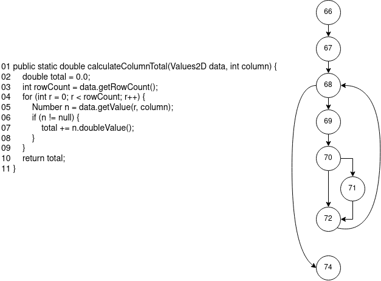
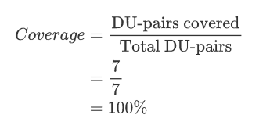
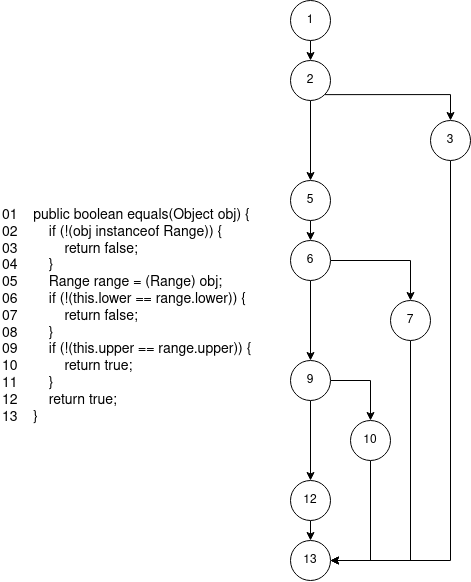
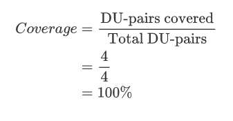

# **Lab. Report #3 – Code Coverage, Adequacy Criteria and Test Case Correlation**

**SENG 637 - Dependability and Reliability of Software Systems**

| Group \#:          | 34                  |
| ------------------ | ------------------- |
| **Student Names:** | Quinn Cooper        |
|                    | Mohd Akram Ansari   |
|                    | John Matthews Sarno |
|                    | Mahsa Malek         |

# 1 Introduction

White-box testing is used to evaluate the code and internal structure of a software program. This is made possible by determining which line of code is properly executed and which is not, making sure that the adequacy criteria of all internal components are met based on the coverage of the test code. Code coverage defines a metric tool used to assess the quality of the test suite and declare how much of the source is tested. The coverage report may include function coverage, statement coverage, decision coverage, condition coverage, and path coverage. 

In this activity, the students used EclEmma as code coverage tool to measure test adequacy. As test cases were designed to improve the code coverage, they managed to determine the pros and cons of Eclemma in measuring adequacy, which will be covered in later sections of this report. Additionally, sufficient knowledge was gained in managing data-flow coverage calculations, which will be presented in Section 2. 

As a continuation of Assignment #2, the System Under Test (SUT) used in this activity remained to be as the JFreeChart, an open-source Java framework for chart calculation, creation, and display. In demonstrating the abilities of coverage tools, the test suite developed in the previous assignment was used. The activity involves three phases: 

- Measuring control-flow coverage 
- Measuring data-flow coverage manually 
- Test- suite development 

# 2 Manual data-flow coverage calculations for X and Y methods

### Method: DataUtilities.calculateColumnTotal

#### Data flow graph

#### Def-use sets per statement

| Line # | DEF        | USE           |
| ------ | ---------- | ------------- |
| 02     | {total}    | {}            |
| 03     | {rowCount} | {}            |
| 04     | {r}        | {r, rowCount} |
| 05     | {n}        | {r}           |
| 06     | {}         | {n}           |
| 07     | {total}    | {total, n}    |
| 08     | {}         | {}            |
| 10     | {}         | {}            |

#### DU-pairs per variable

1. **`total`**

   1. du(66, 71,  total) = {
      	[66, 67, 68, 69, 70, 71, 72, 74]

      }
      
   2. du(71, 71, total) = {
      	[66, 67, 68, 69, 70, 71, 72, 74]

      }

2. **`rowCount`**

   1. du(67, 68, rowCount) = {
      	[66, 67, 68, 74],
      	[66, 67, 68, 69, 70, 72, 74],
      	[66, 67, 68, 69, 70, 71, 72, 74]
      }
   
3. **`r`**

   1. du(68, 68, r) = {
      	[66, 67, 68, 74],
      	[66, 67, 68, 69, 70, 72, 74],
      	[66, 67, 68, 69, 70, 71, 72, 74]
      }
   2. du(68, 69, r) = {
      	[66, 67, 68, 69, 70, 72, 74],
      	[66, 67, 68, 69, 70, 71, 72, 74]
      }
   
4. **`n`**

   1. du(69, 70, n) = {
      	[66, 67, 68, 69, 70, 72, 74],
      	[66, 67, 68, 69, 70, 71, 72, 74]
      }
   2. du(69, 71, n) = {
      	[66, 67, 68, 69, 70, 71, 72, 74]
      }

#### DU-pairs covered by each test case

| Test Case                                                    | Lines Covered                    | DU-pairs covered                                             |
| ------------------------------------------------------------ | -------------------------------- | ------------------------------------------------------------ |
| test_calculateColumnTotal_AllPositive()                      | [66, 67, 68, 69, 70, 71, 72, 74] | du(66, 71,  total) du(71, 71,  total) du(67, 68, rowCount) du(68, 68, r) du(68, 69, r) du(69, 70, n) du(69, 71, n) |
| test_calculateColumnTotal_AllNegative()                      | [66, 67, 68, 69, 70, 71, 72, 74] | du(66, 71,  total) du(71, 71,  total) du(67, 68, rowCount) du(68, 68, r) du(68, 69, r) du(69, 70, n) du(69, 71, n) |
| test_calculateColumnTotal_MixedValues()                      | [66, 67, 68, 69, 70, 71, 72, 74] | du(66, 71,  total) du(71, 71,  total) du(67, 68, rowCount) du(68, 68, r) du(68, 69, r) du(69, 70, n) du(69, 71, n) |
| test_calculateColumnTotal_InvalidInput()                     | [66, 67, 68, 69, 70, 72, 74]     | du(67, 68, rowCount) du(68, 68, r) du(68, 69, r) du(69, 70, n) |
| test_calculateColumnTotal_ExceptionThrows _InvalidParameterException() | [66]                             | None                                                         |

#### DU-Pair coverage.

---

### Method: Range.equals

#### Data flow graph

#### Def-use sets per statement

| Line # | DEF     | USE     |
| ------ | ------- | ------- |
| 01     | {obj}   | {}      |
| 02     | {}      | {}      |
| 03     | {}      | {}      |
| 05     | {range} | {obj}   |
| 06     | {}      | {range} |
| 07     | {}      | {}      |
| 09     | {}      | {range} |
| 10     | {}      | {}      |
| 12     | {}      | {}      |
| 13     | {}      | {}      |

#### DU-pairs per variable

1. **`obj`**

   1. du(1, 2, obj) = {
      	[1,2,3,13],
      	[1,2,5,6,7,13],
      	[1,2,5,6,9,10,13],
      	[1,2,5,6,9,12,13]
      }

   2. du(1, 5, obj) = {
      	[1,2,5,6,7,13],
      	[1,2,5,6,9,10,13],
      	[1,2,5,6,9,12,13]
      }

2. **`range`**

   1. du(5, 6, range) = {
      	[1,2,5,6,7,13],
      	[1,2,5,6,9,10,13],
      	[1,2,5,6,9,12,13]
      }
   2. du(5, 9, range) = {
      	[1,2,5,6,9,10,13],
      	[1,2,5,6,9,12,13]
      }

#### DU-pairs covered by each test case

| Test Case                                                    | Lines Covered     | DU-pairs covered                                             |
| ------------------------------------------------------------ | ----------------- | ------------------------------------------------------------ |
| test_EqualsMethod_PositiveRange_SimilarValues()              | [1,2,5,6,9,12,13] | du(5, 6, range) du(5, 9, range) du(1, 2, obj) du(1, 5, obj) |
| test_EqualsMethod_PositiveRange_DifferentValues()            | [1,2,5,6,7,13]    | du(5, 6, range) du(1, 5, obj) du(1, 2, obj)        |
| test_EqualsMethod_OneNullRange_OneActualRange()              | [1,2,3,13]        | du(1, 2, obj)                                                |
| test_EqualsMethod_NegativeRange_SimilarValues()              | [1,2,5,6,9,12,13] | du(5, 6, range) du(5, 9, range) du(1, 2, obj) du(1, 5, obj) |
| test_EqualsMethod_NegativeRange_DifferentValues()            | [1,2,5,6,7,13]    | du(5, 6, range) du(1, 5, obj) du(1, 2, obj)        |
| test_EqualsMethod_PositiveandNegativeRange_DifferentValues() | [1,2,5,6,7,13]    | du(5, 6, range) du(1, 5, obj) du(1, 2, obj)        |

#### DU-Pair coverage.

# 3 A detailed description of the testing strategy for the new unit test

For our testing strategy for assignment 3, it remained very similar to assignment 2. The primary difference is the ability to look at the source code and being able to see the condition we missed. So naturally less importance was placed on the blackbox methodology and more placed on actively making the coverage go up. 

The rest of our strategy remained consistent. Our boundary value analysis remained the same, alongside our use of mocking. A quick reminder of our boundary value analysis used was:  

1. Invalid input (Bad combination of numerical Inputs) 
2. Negative Value 
3. Positive Value 
4. Null Value 

And for test cases where the input was dependent on ranges we used:  

1. Upper (More than upper bound) 
2. Lower (Less than lower bound) 
3. Edge (At the edges of the range) 
4. Middle (Middle of the range) 

This was for the most part very effective as our original a2 files scored very high coverage. Especially our datautilities test. In fact, the only way we could increase coverage was adding a single null value to our mocking. Our range test did not perform as well, as you will see in the next section this was primarily due to our omitting of tests for the shift and intersects methods. 

# 4 A high level description of five selected test cases you have designed using coverage information, and how they have increased code coverage

- Test_Shift_AllowZeroCrossing 
  We realized that we had missed a coverage case for the shift as it had an optional third passed value that defined a separate use case. This had severe impact on the coverage for the Range class. 
  The test was simple it was merely adapting the current test which was accounting for the zero crossing to be false and converting that answer to if zero crossing is true.  

- test_Intersects_Lower_ImpossibleRange_False 
  The intersects method makes up the bulk of our added test cases as it contributed heavily to the branch coverage (due to eclemma having a combined branch and condition score). Each test covers some of the conditional statements within the intersects method. 
  This test covers a branch where the secondary range cannot exist (i.e., lower bound is larger than upper bound) and the lower bound is lower than the range being tested. 

- Test_Intersects_Within_ImpossibleRange 
  This test covers an impossible range located entirely within the first range. 

- test_Intersects_Within_Positive_True 
  This test covers a possible range entirely within the first range. 

- test_Intersects_Positive_False 
  Finally, we forgot to include a condition where the ranges do not intersect. 

 

# 5 A detailed report of the coverage achieved of each class and method (a screen shot from the code cover results in green and red color would suffice)

### RANGE 

- Instruction 
  

- Branch 
 

- Method 
 

### DATAUTILITIES 

- Instruction 
 

- Branch 
 

- Method 
 

*The only code that is not being executed is the constructor and hence it is impacting the coverage. All methods to be tested have a 100% coverage.* 

# 6 Pros and Cons of coverage tools used and Metrics you report

The following advantages and disadvantages for using EclEmma as a coverage tool were determined along the way as the assignment progresses: 

PROS 

- Easy installation on Eclipse 
- Free to use 
- It has a branch related to coverage 
- Provides easy visualization of feedback to see any wastes in a form of unnecessary code 
- Prevents visual clutter when measuring the code coverage by setting the color of lines (e.g., full coverage) to a different colors

CONS 

- Changes in default keyboard shortcuts such as: 
  - Using **Coverage As|Junit Test** (Alt+Shift+X,T) instead of **Run As|Junit Test** (Alt+Shift+E,T) 
  - In rerunning the last coverage: Ctrl+Shift+F11 instead of Ctrl+F11 
- It lists constructor as a method which leads to inaccuracy in the total coverage.
- Requires switching between the types of coverage which could have been shown in one table.

# 7 A comparison on the advantages and disadvantages of requirements-based test generation and coverage-based test generation.

Requirements-based testing is a more formal and rigorous algorithm than coverage-based testing as it requires high-quality specification. In this manner, the tests are designed to verify that the code follows the requirement from design to code implementation. It aims to increase the reliability of safety of critical systems while keeping the cost of testing to minimum as much as possible. Although it can precisely determine poorly specified requirements, this method is rarely used due to the said complexity in the design, subjective and abstract requirements. To put it simply, it is not too obvious how many test instances have to be developed due to its vagueness and intricacy. Hence, developers tend to lean towards coverage-based testing as it has more tools available online to be used in adequacy testing. 

Coverage testing, on the other hand, is implemented at unit testing level. In addition to simplicity and accessibility, coverage-based testing has the advantage of getting high coverage results which can be obtained by increasing the number of test cases and testing all the functions. This is possible by its capability to determine whether there are enough tests in the unit test suite and if more tests are needed. Unlike requirements-based testing, coverage-based test generation outputs the results quantitatively, which helps the developer to quickly recognize the health of the code. Additionally, it could easily identify and eliminate unused codes during code coverage to improve overall efficiency. The only main disadvantage recognized by the team is that for two different test cases, such as branch and conditions, the coverage is merged and shared among the two. 

# 8 A discussion on how the team work/effort was divided and managed

All activities involved in the assignment were done in a collaborative manner through consistent virtual meetings on Zoom. The testing was done in three phases. Firstly, the familiarization with control-flow coverage and data-flow coverage were strategically done by each member of the group. Afterwards, discussion and exchange of ideas were performed to plan on the actual work, quantifying and allocating the tasks equally to everyone. As usual, the team relied heavily on Github for collaboration. Secondly, as a test plan had been laid out to achieve the adequacy criteria, regular meetings were scheduled and done for the uniformity of the test suite design and collaborate to sharing ideas. Lastly, the final document report was divided equally to everyone while staying in a group call to finalize the report. 

# 9 Any difficulties encountered, challenges overcome, and lessons learned from performing the lab

The main difficulties encountered would be related to the measuring tools and metrics. Since they have different strengths and weaknesses, some of them would be simple and easy to run but have limited features. Minor challenges such as setting up the project on Eclipse had caused unexpected delays in the development time due to troubleshooting minor setup errors. 

# 10 Comments/feedback on the lab itself

Overall, the lab activity itself was successful in imparting the knowledge to students in a practical way. The demonstration of activity was detailed, precise, and easy to follow. Although, some minor setbacks such as setup issues could cause delays in the activity, where specific guidelines are not available in the manual, it opened an opportunity for the team to be more proficient in developing test cases using Eclipse and EclEmma as code coverage tool in general.