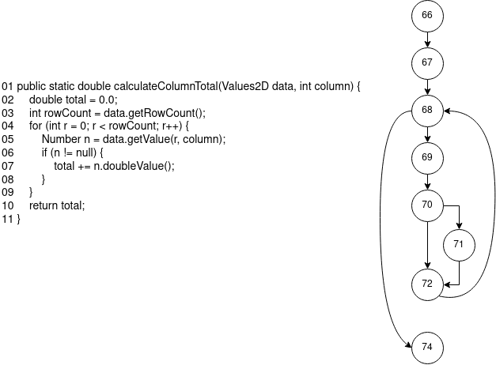
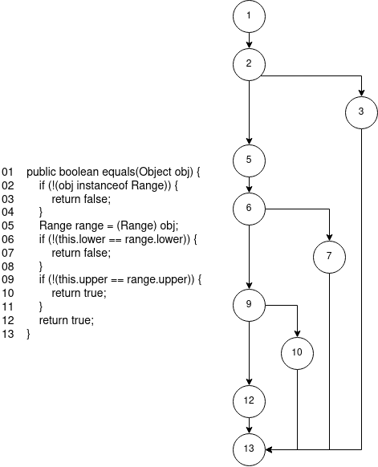

### Method: DataUtilities.calculateColumnTotal

#### Data flow graph

### Def-use sets per statement

| Line # | DEF        | USE           |
| ------ | ---------- | ------------- |
| 66     | {total}    | {}            |
| 67     | {rowCount} | {}            |
| 68     | {r}        | {r, rowCount} |
| 69     | {n}        | {r}           |
| 70     | {}         | {n}           |
| 71     | {total}    | {total, n}    |
| 72     | {}         | {}            |
| 74     | {}         | {}            |

#### DU-pairs per variable

1. **`total`**

   1. du(66, 71,  total) = {
      	[66, 67, 68, 69, 70, 71, 72, 74]

      }
      
   2. du(71, 71, total) = {
      	[66, 67, 68, 69, 70, 71, 72, 74]

      }

2. **`rowCount`**

   1. du(67, 68, rowCount) = {
      	[66, 67, 68, 74],
      	[66, 67, 68, 69, 70, 72, 74],
      	[66, 67, 68, 69, 70, 71, 72, 74]
      }
   
3. **`r`**

   1. du(68, 68, r) = {
      	[66, 67, 68, 74],
      	[66, 67, 68, 69, 70, 72, 74],
      	[66, 67, 68, 69, 70, 71, 72, 74]
      }
   2. du(68, 69, r) = {
      	[66, 67, 68, 69, 70, 72, 74],
      	[66, 67, 68, 69, 70, 71, 72, 74]
      }
   
4. **`n`**

   1. du(69, 70, n) = {
      	[66, 67, 68, 69, 70, 72, 74],
      	[66, 67, 68, 69, 70, 71, 72, 74]
      }
   2. du(69, 71, n) = {
      	[66, 67, 68, 69, 70, 71, 72, 74]
      }

#### DU-pairs covered by each test case

| Test Case                                                    | Lines Covered                    | DU-pairs covered                                             |
| ------------------------------------------------------------ | -------------------------------- | ------------------------------------------------------------ |
| test_calculateColumnTotal_AllPositive()                      | [66, 67, 68, 69, 70, 71, 72, 74] | du(66, 71,  total) du(71, 71,  total) du(67, 68, rowCount) du(68, 68, r) du(68, 69, r) du(69, 70, n) du(69, 71, n) |
| test_calculateColumnTotal_AllNegative()                      | [66, 67, 68, 69, 70, 71, 72, 74] | du(66, 71,  total) du(71, 71,  total) du(67, 68, rowCount) du(68, 68, r) du(68, 69, r) du(69, 70, n) du(69, 71, n) |
| test_calculateColumnTotal_MixedValues()                      | [66, 67, 68, 69, 70, 71, 72, 74] | du(66, 71,  total) du(71, 71,  total) du(67, 68, rowCount) du(68, 68, r) du(68, 69, r) du(69, 70, n) du(69, 71, n) |
| test_calculateColumnTotal_InvalidInput()                     | [66, 67, 68, 69, 70, 72, 74]     | du(67, 68, rowCount) du(68, 68, r) du(68, 69, r) du(69, 70, n) |
| test_calculateColumnTotal_ExceptionThrows _InvalidParameterException() | [66]                             | None                                                         |

#### DU-Pair coverage.

$$
\begin{align*}
Coverage &= \frac {\text {DU-pairs covered}} {\text {Total DU-pairs}} \\
&= \frac {7} {7} \\
&= 100\%
\end{align*}
$$

---

### Method: Range.equals

#### Data flow graph

#### Def-use sets per statement

| Line # | DEF     | USE     |
| ------ | ------- | ------- |
| 01     | {obj}   | {}      |
| 02     | {}      | {}      |
| 03     | {}      | {}      |
| 05     | {range} | {obj}   |
| 06     | {}      | {range} |
| 07     | {}      | {}      |
| 09     | {}      | {range} |
| 10     | {}      | {}      |
| 12     | {}      | {}      |
| 13     | {}      | {}      |

#### DU-pairs per variable

1. **`obj`**

   1. du(1, 2, obj) = {
      	[1,2,3,13],
      	[1,2,5,6,7,13],
      	[1,2,5,6,9,10,13],
      	[1,2,5,6,9,12,13]
      }

   2. du(1, 5, obj) = {
      	[1,2,5,6,7,13],
      	[1,2,5,6,9,10,13],
      	[1,2,5,6,9,12,13]
      }

2. **`range`**

   1. du(5, 6, range) = {
      	[1,2,5,6,7,13],
      	[1,2,5,6,9,10,13],
      	[1,2,5,6,9,12,13]
      }
   2. du(5, 9, range) = {
      	[1,2,5,6,9,10,13],
      	[1,2,5,6,9,12,13]
      }

#### DU-pairs covered by each test case

| Test Case                                                    | Lines Covered     | DU-pairs covered                                             |
| ------------------------------------------------------------ | ----------------- | ------------------------------------------------------------ |
| test_EqualsMethod_PositiveRange_SimilarValues()              | [1,2,5,6,9,12,13] | du(5, 6, range) du(5, 9, range) du(1, 2, obj) du(1, 5, obj) |
| test_EqualsMethod_PositiveRange_DifferentValues()            | [1,2,5,6,7,13]    | du(5, 6, range) du(1, 5, obj) du(1, 2, obj)        |
| test_EqualsMethod_OneNullRange_OneActualRange()              | [1,2,3,13]        | du(1, 2, obj)                                                |
| test_EqualsMethod_NegativeRange_SimilarValues()              | [1,2,5,6,9,12,13] | du(5, 6, range) du(5, 9, range) du(1, 2, obj) du(1, 5, obj) |
| test_EqualsMethod_NegativeRange_DifferentValues()            | [1,2,5,6,7,13]    | du(5, 6, range) du(1, 5, obj) du(1, 2, obj)        |
| test_EqualsMethod_PositiveandNegativeRange_DifferentValues() | [1,2,5,6,7,13]    | du(5, 6, range) du(1, 5, obj) du(1, 2, obj)        |

#### DU-Pair coverage.

$$
\begin{align*}
Coverage &= \frac {\text {DU-pairs covered}} {\text {Total DU-pairs}} \\
&= \frac {4} {4} \\
&= 100\%
\end{align*}
$$